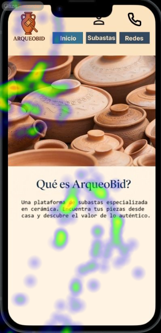
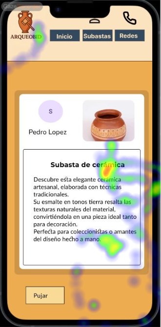

# Usability Report

#### Evaluación de usabilidad del proyecto 
### ArqueoBid
### 30/05/25

[Enlace a GITHUB del proyecto](https://github.com/DIU3-CarlonsoTech/UX_CaseStudy)

### Realizado por:

* :bust_in_silhouette:  Javier García Valderrama (https://github.com/NoVa-5516)    :octocat:     
* :bust_in_silhouette:  Rubén Hidalgo Troyano (https://github.com/RuHiTro)     :octocat:

## 1 DESCRIPCIÓN DEL WEBSITE

El proyecto ArqueoBid tiene por objetivo la adición de un sistema de subastas a la plataforma Kerarqueo, permitiendo así que compradores y vendedores intercambien piezas arqueológicas. La intención de la propuesta es fomentar la difusión y preservación del patrimonio arqueológico mediante un entorno digital especializado.

## 2 RESUMEN EJECUTIVO

Este documento es un informe de usabilidad, que contiene los resultados de un estudio realizado de forma comparativa (por A/B Testing) entre nuestra propuesta y esta. A continuación se detallarán la metodología seguida, además de exponer las conclusiones obtenidas a raíz de los resultados del estudio.

A modo de resumen breve de los problemas encontrados, muchos de los usuarios reportaron tener problemas con ciertos elementos de la interfaz. Entre otras cosas, también se ha detectado que algunas partes importantes
del diseño no han logrado captar la atención de los usuarios.

## 3 METODOLOGIA 

#### Metodología de usabililidad

Este estudio se ha basado en emplear A/B Testing para, de forma comparativa, analizar y evaluar la usabilidad tanto de nuestra propuesta como la valorada en este informe.

Para este estudio concreto, se han usado varios tipos de pruebas, entrelazados de modo que se obtuviesen la mayor cantidad de datos útiles posibles: preguntas previas -> eye-tracking -> tareas en prototipo -> preguntas posteriores. Para poder crear y realizar las pruebas, han sido necesarias herramientas como Maze (https://maze.co/) o GazeRecorder (https://gazerecorder.com/).

Debido a la naturaleza de este estudio, las pruebas fueron diseñadas para poder ejecutarse de forma remota o presencial, con las debidas instrucciones dadas a los usuarios para que pudieran realizar su aportación debidamente.
 

#### Test de usuarios: Participantes

Estos fueron los usuarios reclutados para la realización del estudio mediante A/B Testing:

| # Id Usuario  | Sexo/Edad | Ocupación   |  Exp.TIC    | Plataforma | Caso
| ------------- | --------- | ----------- | ----------- | ---------- | ----
| 1  | H / 21    | Estudiante universitario  | Alta        | Web, remoto       | A 
| 2  | M / 23    | Cajera de supermercado      | Media       | Web, remoto        | A 
| 3  | M / 45    | Limpiadora     | Baja        | Web, presencial      |  A
| 4  | H / 16    | Estudiante de secundaria | Media       | Web, presencial        | B 
| 5  | H / 59    | Supervisor de ventas | Media-baja       | Web, presencial        | B 

#### Resultados obtenidos

##### Preguntas previas y posteriores (mediante Maze)

A través de una serie de preguntas previas, se ha determinado que los usuarios reclutados para valorar el caso B no suelen adquirir artículos por Internet con demasiada frecuencia y que ninguno ha asistido alguna vez a una subasta de productos.

Con las preguntas posteriores realizadas, los usuarios han mostrado de forma unánime su descontento con el posicionamiento del icono de acceso a la pantalla de perfil, el cual estaba parcialmente cubierto por el marco del prototipo. Otro aspecto en el que se han puesto de acuerdo los usuarios es la facilidad de uso con la que cuenta la aplicación.

##### Eye-tracking (mediante GazeRecorder)

A continuación, se muestran los resultados de eye-tracking llevados a cabo para este caso

Como se puede apreciar, la parte superior (logotipo y navegación) pasan desapercibidos, concentrándose la atención de los usuarios en la zona central de la pantalla. 

##### Cuestionario SUS (System Usability Scale)

## 4 CONCLUSIONES 

(qué podemos extraer de conclusion con las pruebas de usabilidad efectuadas)

#### Incidencias

* (indicad si algo ha fallado o no se ha podido realizar correctamente por algún motivo)

#### Valoración 

* (Puntos Positivos a destacar)

#### Recomendaciones y propuesta de mejoras: 

* (Puntos de mejora)

#### Valoración de la prueba de usabilidad (self-assesment)

(valoración personal de si han sido útiles estas técnicas para detectar errores ocultos o falllos de usabilidad en este caso )
