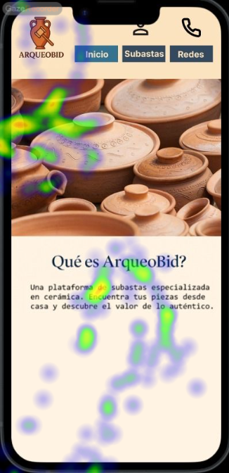
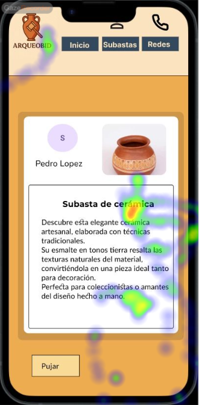
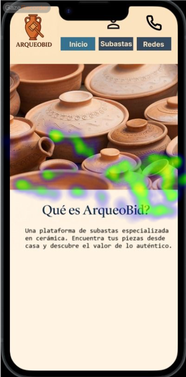

# Usability Report

#### Evaluación de usabilidad del proyecto 
### ArqueoBid
### 30/05/25

[Enlace a GITHUB del proyecto](https://github.com/DIU3-CarlonsoTech/UX_CaseStudy)

### Realizado por:

* :bust_in_silhouette:  Javier García Valderrama (https://github.com/NoVa-5516)    :octocat:     
* :bust_in_silhouette:  Rubén Hidalgo Troyano (https://github.com/RuHiTro)     :octocat:

## 1 DESCRIPCIÓN DEL WEBSITE

El proyecto ArqueoBid tiene por objetivo la adición de un sistema de subastas a la plataforma Kerarqueo, permitiendo así que compradores y vendedores intercambien piezas arqueológicas. La intención de la propuesta es fomentar la difusión y preservación del patrimonio arqueológico mediante un entorno digital especializado.

## 2 RESUMEN EJECUTIVO

Este documento es un informe de usabilidad, que contiene los resultados de un estudio realizado de forma comparativa (por A/B Testing) entre nuestra propuesta y esta. A continuación se detallarán la metodología seguida, además de exponer las conclusiones obtenidas a raíz de los resultados del estudio.

A modo de resumen breve de los problemas encontrados, muchos de los usuarios reportaron tener problemas con ciertos elementos de la interfaz. Entre otras cosas, también se ha detectado que algunas partes importantes
del diseño no han logrado captar la atención de los usuarios.

## 3 METODOLOGIA 

#### Metodología de usabililidad

Este estudio se ha basado en emplear A/B Testing para, de forma comparativa, analizar y evaluar la usabilidad tanto de nuestra propuesta como la valorada en este informe.

Para este estudio concreto, se han usado varios tipos de pruebas, entrelazados de modo que se obtuviesen la mayor cantidad de datos útiles posibles: preguntas previas -> eye-tracking -> tareas en prototipo -> preguntas posteriores. Para poder crear y realizar las pruebas, han sido necesarias herramientas como Maze (https://maze.co/) o GazeRecorder (https://gazerecorder.com/).

Debido a la naturaleza de este estudio, las pruebas fueron diseñadas para poder ejecutarse de forma remota o presencial, con las debidas instrucciones dadas a los usuarios para que pudieran realizar su aportación debidamente.
 

#### Test de usuarios: Participantes

Estos fueron los usuarios reclutados para la realización del estudio mediante A/B Testing:

| # Id Usuario  | Sexo/Edad | Ocupación   |  Exp.TIC    | Plataforma | Caso
| ------------- | --------- | ----------- | ----------- | ---------- | ----
| 1  | H / 21    | Estudiante universitario  | Alta        | Web, remoto       | A 
| 2  | M / 23    | Cajera de supermercado      | Media       | Web, remoto        | A 
| 3  | M / 45    | Limpiadora     | Baja        | Web, presencial      |  A
| 4  | H / 16    | Estudiante de secundaria | Media       | Web, presencial        | B 
| 5  | H / 59    | Supervisor de ventas | Media-baja       | Web, presencial        | B 

#### Resultados obtenidos

##### Preguntas previas y posteriores (mediante Maze)

A través de una serie de preguntas previas, se ha determinado que los usuarios reclutados para valorar el caso B no suelen adquirir artículos por Internet con demasiada frecuencia y que ninguno ha asistido alguna vez a una subasta de productos.

Con las preguntas posteriores realizadas, los usuarios han mostrado de forma unánime su descontento con el posicionamiento del icono de acceso a la pantalla de perfil, el cual estaba parcialmente cubierto por el marco del prototipo. Otro aspecto en el que se han puesto de acuerdo los usuarios es la facilidad de uso con la que cuenta la aplicación.

##### Eye-tracking (mediante GazeRecorder)

A continuación, se muestran los resultados de eye-tracking llevados a cabo para este caso

Como se puede apreciar, la atención de los usuarios se concentra en la parte central de las diferentes páginas.
La parte superior, la cabecera con el logotipo y la navegación, pasa mayormente desapercibida, al igual que el botón "Pujar" de la página de subasta. 

##### Cuestionario SUS (System Usability Scale)

Como parte final de las pruebas realizadas, se le pidió a los usuarios reclutados que rellenasen el cuestionario SUS para el caso que habían podido analizar durante el proceso de prueba. A continuación, se proporciona una tabla con los resultados para esta propuesta (el caso B):

| # Id.usuario | Caso | Puntuación SUS |
| ------------ | ---- | -------------- |
| 4            | B    | 62.5           |
| 5            | B    | 70             |

Estos resultados dejan a esta propuesta con una puntuación media de 66.25, posicionándose en el rango marginal.

## 4 CONCLUSIONES 

Una vez efectuadas las pruebas de usabilidad, esto es lo que se puede concluir a partir de ellas:

El diseño de la propuesta es sólido y resulta fácil de usar para los usuarios, con una elección de estilo muy acertada para la temática de la propuesta. No obstante, gran parte de sus esfuerzos se ven perjudicados por el posicionamiento de los elementos y por no poner énfasis en las partes más cruciales de cada página de la propuesta.

#### Incidencias

- GazeRecorder no ha sido muy cooperativo. Los problemas de calibración y una mala detección de la vista de los usuarios ha provocado que pudiéramos obtener muy poco contenido útil, aunque finalmente suficiente para realizar exitosamente el estudio.

#### Valoración 

- Interfaz fácil de usar -> no existe complejidad excesiva en la navegación, lo cual hace sencillo llegar a donde queremos
- Elección de estilo acertada -> la paleta de colores y la tipografia proporcionan un nivel de contraste excelente, haciendo que se pudieran distinguir los contenidos de forma clara.

#### Recomendaciones y propuesta de mejoras: 

- Reposicionar la barra superior -> tal y como está, gran parte la cubre el marco del prototipo, y eso oculta ciertos iconos de gran importancia.
- Fijar la barra superior -> al hacer scroll por la pantalla de subastas, la barra superior se oculta, obligando a tener que hacer scroll de vuelta al principio para navegar a otra página distinta.
- Reajustar los elementos en los detalles de la subasta -> además de que existe scroll lateral (aunque poco), tener el botón "Pujar" tan abajo y alejado de la zona principal provoca que no llame la atención, lo cual puede afectar a la capacidad de los usuarios de completar tareas relacionadas.

#### Valoración de la prueba de usabilidad (self-assesment)

Para cerrar este informe, nos gustaría aportar nuestra valoración sobre la prueba de usabilidad realizada:

Este estudio comparativo mediante A/B Testing nos ha permitido obtener feedback de usuarios reales, muy valioso en casos reales para mejorar los productos que se ofrecen a los clientes. En este caso, aunque el número de usuarios que hemos podido reclutar no ha sido el que nos hubiera gustado, el valor de la información obtenida es el mismo.

La realización de preguntas previas y posteriores nos ha permitido obtener un mejor entendimiento de qué aspectos tienen en cuenta los usuarios sobre la usabilidad de una aplicación o página web.

El eye-tracking, a pesar de los problemas ya declarados, ha permitido ver qué falla en el flujo general de las aplicaciones: qué zonas son más propensas a "robar" la atención, qué zonas no se están resaltando lo suficiente...

En general, el uso de varios métodos combinados para obtener retroalimentación de usuarios reales ha proporcionado una forma satisfactoria de dar con problemas, errores o fallos que hubieran sido más difíciles de encontrar de otra forma.
