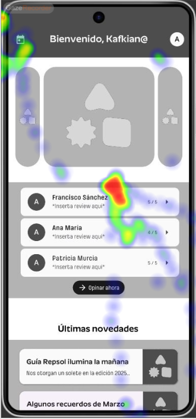

# DIU - Practica 4

## 1. Introducción
Ahora que hemos desarrollado prototipos para nuestras propuestas, es hora de analizarlos y evaluar cuáles son sus puntos fuertes y dónde flaquean. Para esto, se nos encomienda organizar un estudio con usuarios reales en el que evaluemos tanto nuestra propuesta como una de nuestros compañeros, la cuál nos será asignada.

## 2. Reclutamiento de usuarios para A/B Testing

| # Id Usuario  | Sexo/Edad | Ocupación   |  Exp.TIC    | Plataforma | Caso
| ------------- | --------- | ----------- | ----------- | ---------- | ----
| 1  | H / 21    | Estudiante universitario  | Alta        | Web, remoto       | A 
| 2  | M / 23    | Cajera de supermercado      | Media       | Web, remoto        | A 
| 3  | M / 45    | Limpiadora     | Baja        | Web, presencial      |  A
| 4  | H / 16    | Estudiante de secundaria | Media       | Web, presencial        | B 
| 5  | H / 59    | Supervisor de ventas | Media-baja       | Web, presencial        | B 

## 3. Diseño de las pruebas
Las pruebas llevadas a cabo como parte de este A/B Testing han seguido la siguiente estructura
- Un par de preguntas introductorias según el caso examinado.
- Eye tracking del caso correspondiente (2 imágenes, 15 segundos cada una)
- Algunas tareas con el prototipo del caso a valorar.
- Preguntas más detalladas sobre la experiencia de uso y el diseño de los prototipos.
- Cuestionario SUS sobre el caso.

### 3.1 Tests usando Maze
Para llevar a cabo gran parte de la recopilación de datos, se han usado tests creados con la
herramienta [Maze](https://maze.co/), la cual nos ha permitido organizar cuestionarios donde
poder utilizar los prototipos sin romper el flujo del test.

#### Preguntas previas según el caso
Caso A:
- ¿Con qué frecuencia utiliza Internet para reservar eventos?
- ¿Ha asistido alguna vez a una degustación culinaria?

Caso B:
- ¿Con qué frecuencia adquiere artículos por Internet?
- Ha participado alguna vez en una subasta de productos?

#### Tareas en prototipo según el caso
Caso A:
- Realización de una reserva en un evento.
- Acceder al perfil para modificar información.

Caso B:
- Realización de puja en una subasta.
- Acceder a la página de perfil para iniciar sesión

#### Preguntas posteriores (comunes a ambos casos)
- ¿Está satisfecho con la navegación del prototipo?
- ¿Ha necesitado tiempo para familiarizarse con el prototipo?
- ¿Cómo describiría su experiencia utilizando la interfaz del prototipo?
- ¿Qué aspecto del diseño del prototipo le parece más destacable?
- ¿Fue capaz de distinguir los contenidos de las páginas?

### 3.2 Eye tracking (usando GazeRecorder)
Cada uno de los usuarios participantes en este estudio han realizado su correspondiente eye-tracking sobre el caso que se les ha asignado. A continuación exponemos solo un resultado de cada caso, para mantener este informe breve, pero se pueden acceder al resto en la carpeta designada de esta práctica.

Eye-tracking A:

;
;

Eye-tracking B:

;
;

### 3.3 Cuestionarios SUS (System Usability Scale)
Como última parte de los tests realizados, se pidió a cada participante que rellenase el cuestionario SUS sobre el caso que habían visto y probado. Estos fueron los resultados.

| # Id.usuario | Caso | Puntuación SUS |
| ------------ | ---- | -------------- |
| 1            | A    | 82.5           |
| 2            | A    | 90             |
| 3            | A    | 77.5           |
| 4            | B    | 62.5           |
| 5            | B    | 70             |

Se pueden ver los tests SUS completos en la carpeta [resultados_sus](./resultados_sus/).

#### Conclusiones de los cuestionarios SUS

Antes de exponer nuestras conclusiones sobre los resultados de estos cuestionarios, nos gustaría destacar que nuestro estudio ha estado muy limitado en el número de usuarios que hemos podido reclutar, y también en su variedad.

Finalmente, las puntuaciones medias quedan de la siguiente forma: el caso A con una media de 83.3, dentro del rango aceptable, y el caso B con una media de 66.25, dentro del rango marginal.

Consideramos que los resultados, aunque muy útiles para obtener feedback de usuarios reales, no son lo suficientemente numerosos como para formar una muestra representativa de la calidad de cualquiera de los casos. Ambos casos han tenido sus problemas, y ambos han tenido sus áreas destacadas.

## 4. Conclusiones del estudio realizado

A modo de resumen de todo lo aprendido de este estudio, ofrecemos la siguiente valoración:

Las técnicas aplicadas en la realización de este estudio nos han proporcionado una buena primera experiencia. La gran variedad de metodologías que se pueden aplicar dan lugar a que existan muchas posibilidades para conocer mejor los puntos fuertes y débiles de nuestros proyectos. 

Saber obtener feedback de los usuarios, que al fin y al cabo son quienes van a usar nuestras propuestas, es crucial en el mundo de la informática, y esta práctica nos lo ha hecho saber. Las dificultades afrontadas durante la realización del estudio son una parte más de la experiencia, y también se ha aprendido de ellas.

## 5. Usability Report del caso B
Nos fue asignado como caso B el proyecto [ArqueoBid](https://github.com/DIU3-CarlonsoTech/UX_CaseStudy), desarrollado por nuestros compañeros del grupo "DIU3.CarlosTech". El reporte de usabilidad asociado se detalla en el siguiente documento: [Usability Report "ArqueoBid"]()
