# DIU25
Prácticas Diseño Interfaces de Usuario (Tema: El ocio y comercio sostenible) 

[Guiones de prácticas](GuionesPracticas/)

Grupo: DIU2_Ni-idea.  Curso: 2024/25 

Actualizado: 28/05/2025

Proyecto: 

La Taberna de Kafka (2.0)

Descripción: 

Nuestra propuesta consiste en dotar a La Taberna de Kafka de una plataforma web propia que permita al establecimiento contactar con sus clientes (y viceversa) para fomentar el ambiente comunitario y cercano que tanto ha beneficiado al local, pero sin depender tanto de medios externos. Nuestra misión es convertir la taberna en un espacio accesible para el ocio de degustación, incitando curiosidad sobre la gastronomía española mientras se disfrutan de productos locales. Para ello, dotamos a nuestra propuesta de las funciones y características deseadas en este tipo de plataformas, facilitando el contacto con otros usuarios y con el establecimiento.

Buscamos dotar a la página de las herramientas típicas de otras webs de hostelería (reseñas, comentarios...), además de proporcionar a los usuarios una idea bastante formada del tipo de experiencias que pueden esperarse de la taberna. 

Logotipo: 

- Logotipo (claro):

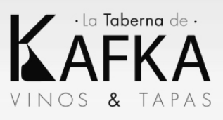

- Logotipo (oscuro):

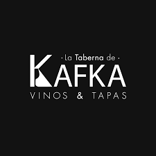

Ambos logotipos son los ya utilizados por el establecimiento. Hemos decidido mantenerlos porque encajan bien con el estilo de simpleza y elegancia que queremos darle a nuestra propuesta.

Slogan / Frase de marca:

#### No venimos a probar vino, venimos a saborear la vida.

Miembros:
 * :bust_in_silhouette:  Javier García Valderrama (https://github.com/NoVa-5516)    :octocat:     
 * :bust_in_silhouette:  Rubén Hidalgo Troyano (https://github.com/RuHiTro)     :octocat:

----- 

# Proceso de Diseño 

 

## Paso 1. UX User & Desk Research & Analisis 

### 1.a User Reseach Plan
 
-----

Dentro del ámbito de la gastronomía (u ocio) de degustación, no contamos con un conocimiento muy profundo. Sabemos que existe, tenemos una idea general de su propósito y también una idea de su público objetivo, pero nada más allá de ello.

Para afrontar nuestra falta de información previa, seguiremos una estrategia basada en los siguientes puntos:
 - Llevar a cabo una investigación que combine métodos cualitativos (entrevistas, estudios etnográficos...), que nos permitirán saber qué motiva a los usuarios, y cuantitativos (encuestas, análisis estadísticos...), que nos proporcionarán información medible sobre las acciones de dichos usuarios. Además, emplearemos enfoques de observación junto con estudio del comportamiento para mayor efectividad. Nuestro objetivo es tener una visión lo más clara posible del ámbito, y para ello es necesario combinar estos cuatro aspectos en nuestra investigación, al ser complementarios.
 - A partir de nuestra investigación, estableceremos un plan que describa: objetivos, métodos, participantes, detalles logísticos y otros documentos relevantes del estudio.

Enlace al recurso: [User Research Plan](P1/User_Research_Plan.pdf)

### 1.b Competitive Analysis
 
-----

Nuestro caso de estudio se centrará en La taberna de Kafka, un local que, además de ser restaurante y servir tapas, ofrece catas de vinos públicas y privadas. Hemos optado por esta opción dado que no cuenta con una página web oficial, lo que presenta una situación interesante para estudio.

De cara a su análisis comparativo, hemos decidido buscar dos competidores cercanos geográficamente que también ofrecen catas, entre otros servicios: Granada Gourmet y Bodegas Calvente.

Granada Gourmet (posiblemente renombrado a “Picnic Gourmet”): ofrece gran variedad de productos, desde jamones y aceites hasta encurtidos. Su página web deja que desear en términos de rendimiento y usabilidad, además de no reflejar en su totalidad el aparente renombre a “Picnic Gourmet”, pero cuenta con las funcionalidades que cabría esperar de un diseño web actual (selección de idioma, adaptable al dispositivo…). 

Bodegas Calvente: se centra considerablemente más en la cultura del vino. Su modelo de negocio está basado íntegramente en las ventas y catas de vino (a lo cual se ha añadido la venta de aceites también), respaldando esto con una página bien construida, aunque con algunos defectos (selección de idioma no del todo funcional, p.e).

En comparación a los dos establecimientos anteriormente mencionados, La taberna de Kafka no dispone de ningún tipo de página web, en su lugar dependiendo enteramente de sus cuentas en redes sociales y de mensajería para el desarrollo de sus actividades. A pesar de carecer severamente en el aspecto tecnológico y de página web, esto se compensa con la experiencia que otorgan en persona y favoreciendo el uso del "boca a boca" para darse a conocer.

Enlace a recurso: [Competitor Analysis](P1/Competitor_Analysis/Competitor_Analysis.pdf)

### 1.c Personas
 
-----

Mark Powells: esta Persona ilustra un tipo de cliente común para el ocio de degustación: el turista extranjero. Su falta de dominio del idioma, su escaso conocimiento de la cultura, y el poco tiempo que tiene disponible son idóneos para comprobar si nuestro caso es capaz de satisfacer las necesidades del cliente a pesar de los impedimentos comunicativos y falta de preparación.

.png)

Patricia Murcia: Patricia es un buen perfil para ser cliente de una cata de vinos, debido a que reúne varios criterios deseados por un establecimiento de gastronomía/ocio como puede ser un perfil profesional, con un buen nivel económico y que busca celebrar un acontecimiento especial de forma que, en caso de agradarle la experiencia, seguramente quiera repetirla y puede permitírselo. Sin embargo, debido a su nivel de exigencia, cualquier pequeño inconveniente injustificado puede enturbiar su experiencia y provocar su animadversión a regresar al local. Patricia representa al cliente exigente pero que los empresarios desean retener.

.png)

### 1.d User Journey Map
 
----

El caso de Mark Powells es interesante porque es bastante común en el ámbito del ocio de degustación. Un turista sin apenas conocimiento del idioma o cultura intenta reservar improvisadamente una experiencia refinada y que le permita conocer mejor su entorno, pero acaba topándose con problemas graves de accesibilidad de idioma y complicaciones en el proceso de contactar con el local.

.png)

En cuanto al caso de Patricia, nos otorga un punto de vista distinto que permite averiguar si el establecimiento proporciona la información necesaria y exacta para que sus clientes puedan completar tareas y objetivos con éxito y sin frustarse. Comienza algo animada porque una cata privada es una experiencia novedosa. No obstante, la falta de web oficial e información explicita por parte de La taberna de Kafka provoca que el proceso de reserva se le haga incómodo, no permitiéndole disfrutar el proceso de recabar información y posterior reserva, y haciendo que la experiencia final no sea como hubiese querido.

.png)

### 1.e Usability Review
 
----

Enlace al documento: [Usability Review](P1/Usability_Review/Usability_Review_Kafka.pdf)

URL y Valoración numérica obtenida: [La taberna de Kafka](https://www.facebook.com/laTabernadeKafka) --> Puntuación: 54 - Moderate

Comentario sobre la revisión:
- Puntos fuertes: contenido publicado, servicios ofrecidos (catas de vinos temáticas…), rendimiento de la plataforma…
- Puntos débiles: enlaces rotos, no se aporta suficiente información para realizar la mayoría de tareas, no tiene página web (depende exclusivamente de sus plataformas de redes sociales)…

En general, nuestro caso se beneficiaría de migrar su actividad a una página web propia, con capacidad de búsqueda y con información abundante sobre sus servicios, cómo reservar… Además, disponer de un formulario de reserva u otro tipo de asistencia para realizar las reservas solventaría muchos de los contratiempos que surgen de tener que contactar directamente con ellos para hacerlo.

 

## Paso 2. UX Design  

### 2.a Reframing / IDEACION: Feedback Capture Grid / EMpathy map 
 
----

Los principales problemas de La Taberna de Kafka son su dependencia de las redes sociales y la ausencia de una página web propia en la que ofrecer detalles de sus servicios y funciones beneficiosas para la usabilidad y la experiencia de usuario.

Para solucionar ambos problemas, se propone el diseño y creación de una página web propia que cuente con todas aquellas funciones de las que carece actualmente en materia de experiencia de usuario, como: búsqueda, calendario de eventos, reseñas, etc. Juntando lo anterior con una reevaluación de la estrategia de negocio para proporcionar una vía accesible al ocio de degustación y provocar curiosidad por la gastronomía española, se puede incentivar la fidelidad de los usuarios y recompensarla. 

### 2.b ScopeCanvas

----

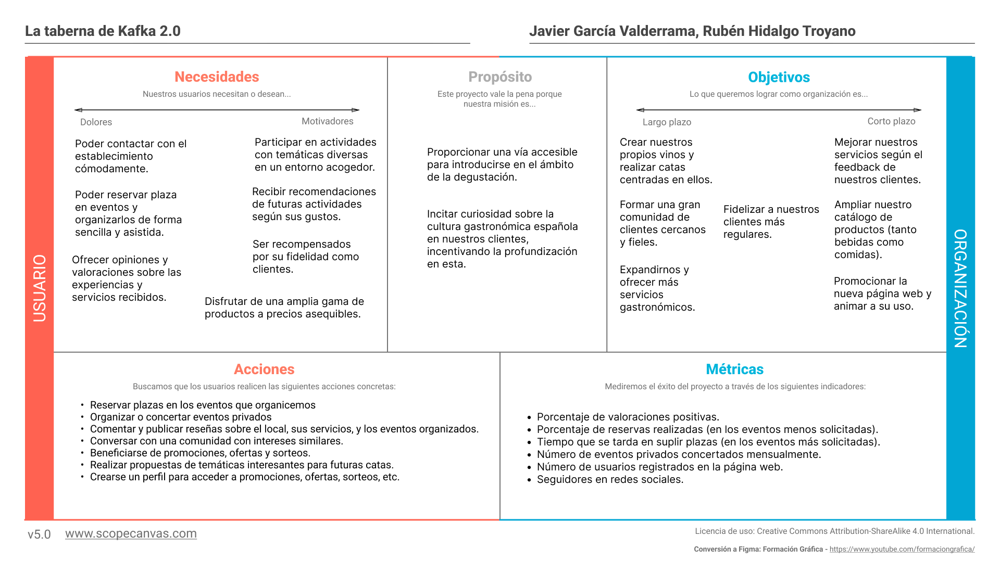

### 2.c User Flow (task) analysis 
 
-----

El análisis de tareas realizado para nuestra propuesta incluye una valoración de la importancia de estas para diferentes categorías de usuarios: usuarios sin registrar (visitantes cualquiera a la página), usuarios registrados (que pueden acceder a más funcionalidades, como reseñas, comentarios...) y administradores (encargados de gestionar el contenido de la página).

No todos los tipos de usuarios tienen valoración de importancia para todas las tareas, dado que algunas no están accesibles para ellos o no tiene sentido valorarlas.

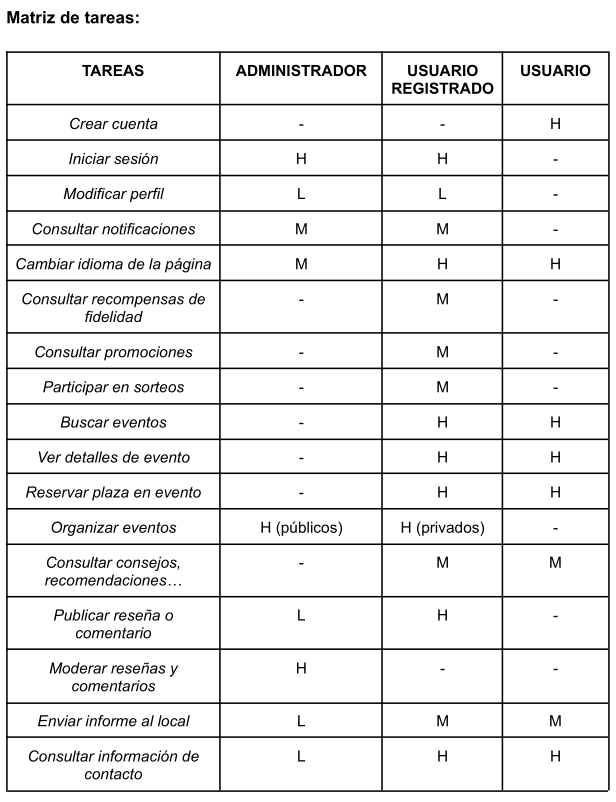

### 2.d IA: Sitemap + Labelling 
 
----

Este es el sitemap de nuestra propuesta. En color rojo están las páginas e información accesibles para todos los usuarios de la página, registrados o no. En color azul, el contenido únicamente accesible para usuarios registrados.

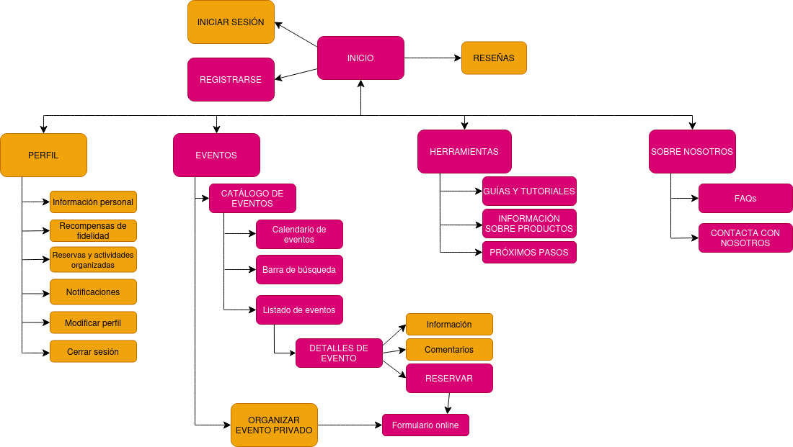

A contiuación figura el labelling de nuestra propuesta, que incluye también la descripción de los iconos o logos utilizados para algunas funciones o términos: 

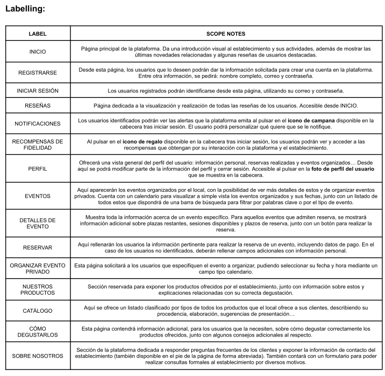

### 2.e Wireframes
 
-----

Para el bocetado a mano se ha empleado una tablet (con su correspondiente lápiz táctil) y una aplicación de notas instalada por defecto (Nebo). Para la realización de los wireframes del layout, se ha utilizado la plataforma online Figma.

PÁGINA DE INICIO: es la página que verán nuestros usuarios nada más entrar en nuestra web. Cuenta con un carrusel de imágenes en la parte superior, por debajo del headline. Después del carrusel, se listan algunas reseñas de los clientes y se ofrece la posibilidad de saltar a la página de reseñas directamente.

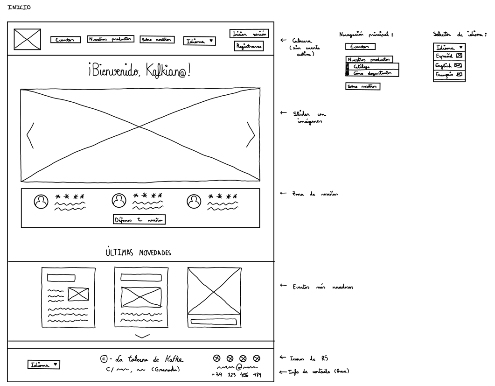
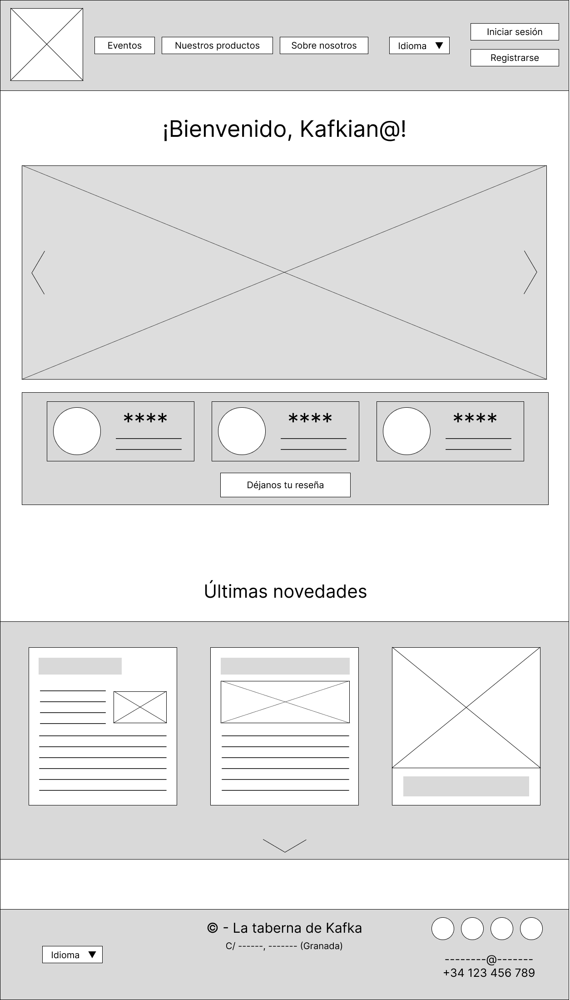

INICIO DE SESIÓN Y REGISTRARSE: aparecerán para usuarios no registrados en el sistema, y consistirán en formularios con varios campos, debidamente etiquetados (y marcados, si son obligatorios).

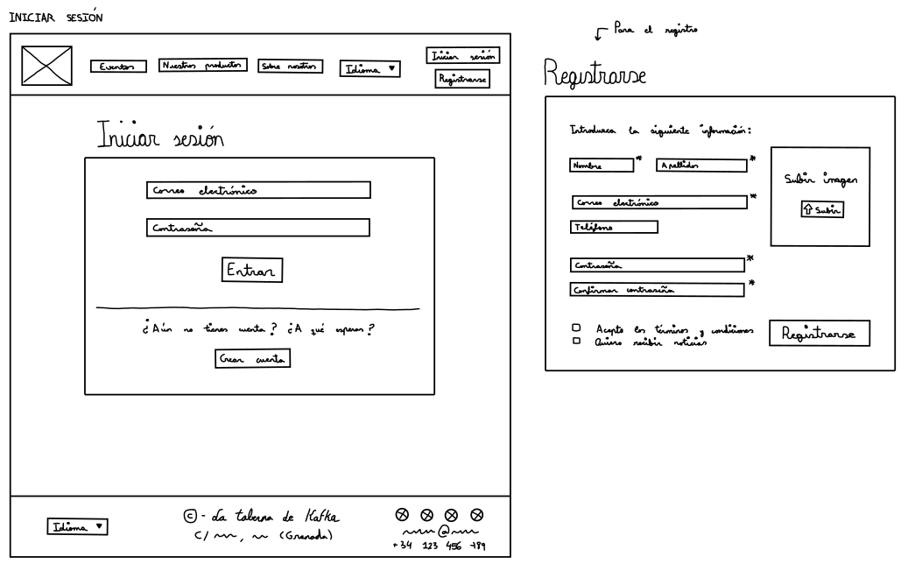

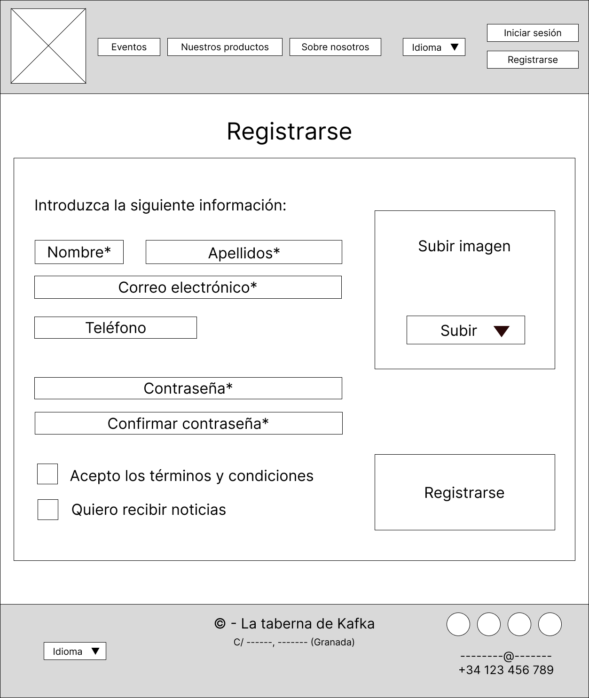

PERFIL: podrán acceder los usuarios identificados. Tendrán la posibilidad de editar su información personal y podrán visualizar tanto las reservas realizadas como los eventos privados organizados.

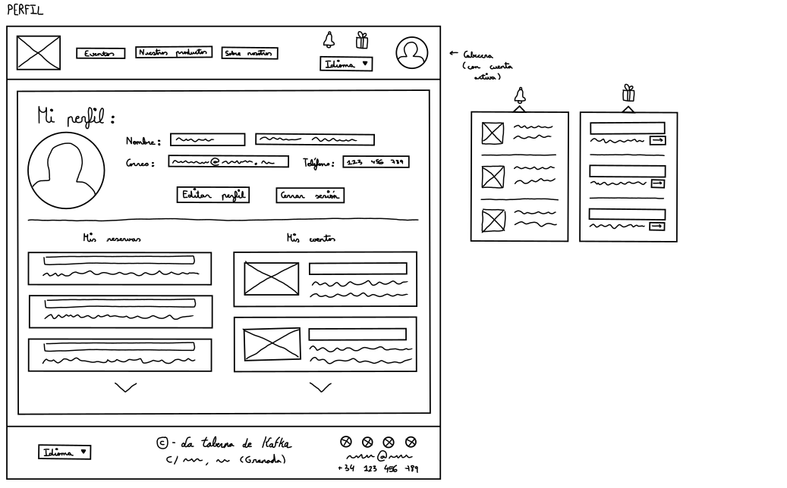
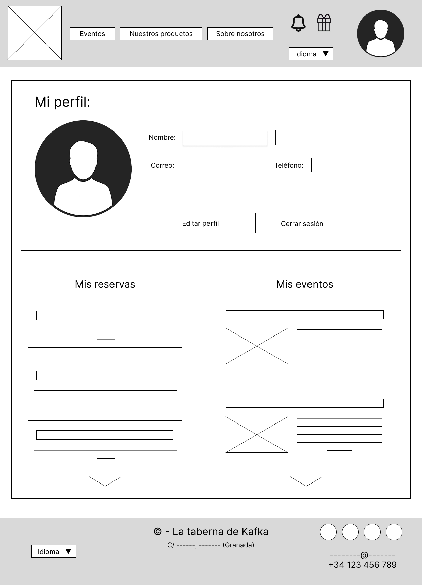

EVENTOS: esta página resumirá los diferentes eventos y actividades organizadas por el establecimiento. Dispondrá de un calendario que muestre a simple vista qué eventos tienen lugar en qué fechas, junto con un listado de todos los eventos más abajo (que además cuenta con una opción de búsqueda para llegar más rápido al contenido deseado).

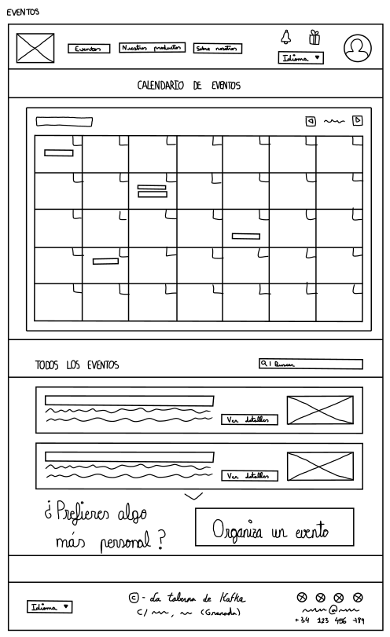
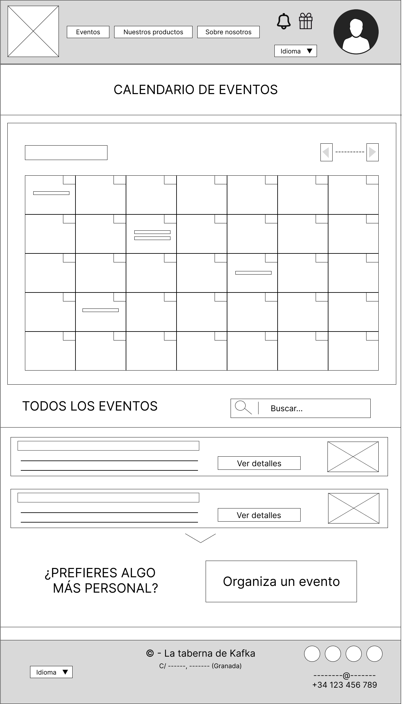

A modo de vista general del prototipado Lo-Fi:
- Bocetos a mano del layout --> [Bocetos_P2](P2/5_Prototipo_Lo-Fi/Bocetos/Bocetos_P2.pdf)
- Wireframes del layout --> [Wireframes_P2](P2/5_Prototipo_Lo-Fi/Wireframes/Wireframes.pdf)

 

## Paso 3. Mi UX-Case Study (diseño)

### 3.a Moodboard

-----

Para el moodboard de nuestra propuesta hemos rellenado la plantilla disponible en Figma. En ella, hemos especificado los aspectos más importantes del estilo de nuestra marca:
- Logotipo: hemos mantenido los logotipos claro y oscuro del establecimiento, dado que se ajustan bien a la sensación de elegancia, sofisticación y simpleza que buscamos. Se obtuvieron de la página de <b>Facebook</b> del local.
- Frase motivadora de la marca: refuerza nuestra intención de proporcionar experiencias que inciten a los clientes a profundizar en la gastronomía española.
- Paleta de colores: se obtuvo gracias a Coolors, y representa los ideales de nuestra marca - elegancia, sofisticación y simpleza. Aunque no se diferencia enormemente de la ya utilizada por el local, sí está ajustada para resaltar las anteriores tres características.
- Tipografías: Roundo para resaltar los títulos, Pilcrow Rounded para dar legibilidad y un toque moderno a los textos. Se obtuvo esta pareja de fuentes de la página Font Pair.

Las imágenes de inspiración y el tipo de imágenes que se usarían en nuestra propuesta han sido todas obtenidas de diferentes páginas de internet.

### 3.b Landing Page
 
----

Esta landing page tiene por objetivo atraer a gente interesada en nuevas experiencias. Mediante la imagen de fondo y la frase inspiradora, se expone qué ofrece el local: catas y vino. Como se puede apreciar, se han empleado la paleta de colores y el estilo tipográfico ya propuestos en nuestros moodboard.

Para resaltar positivamente el establecimiento, se incluyen reseñas que destaquen elementos importantes: lo que se ofrece, el ambiente y el entorno que se vive.

Para más información, se da la posibilidad de acceder a más información mediante el menú de navegación de la parte superior, que llevará a páginas breves que ofrecerán una versión resumida de su equivalente en la página web.

Por último, se añade un CTA en forma de botón, que enlazaría con la página principal de la web de nuestra propuesta.

### 3.c Guidelines
 
----

De cara al diseño y creación de un prototipo móvil, especificamos los siguientes patrones de diseño a utilizar. Muchos de ellos se basan en componentes del Material 3 Design Kit de Google, el cual se puede encontrar como biblioteca de Figma.

### 3.d Mockup
 
----

El mockup (prototipo de alta definición) se puede visualizar desde el siguiente enlace: [Prototipo Hi-Fi](https://www.figma.com/proto/NdmikAMRVXkm9NCHWrjz0f/La-Taberna-de-Kafka--2.0----DIU2_Ni-idea?node-id=0-1&t=0ovcBklMheiHHqlH-1)

### 3.e ¿My UX-Case Study?
 
-----

Este repositorio de GitHub contiene todo el contenido de nuestro Case Study, organizado debidamente.

 

## Paso 4. Pruebas de Evaluación 

### 4.a Reclutamiento de usuarios 

-----

Nos fue asignado como caso B el proyecto [ArqueoBid](https://github.com/DIU3-CarlonsoTech/UX_CaseStudy), una propuesta de subastas de piezas arqueológicas desarrollada por nuestros compañeros del grupo "DIU3.CarlosTech".

| # Id Usuario  | Sexo/Edad | Ocupación   |  Exp.TIC    | Plataforma | Caso
| ------------- | --------- | ----------- | ----------- | ---------- | ----
| 1  | H / 21    | Estudiante universitario  | Alta        | Web, remoto       | A 
| 2  | M / 23    | Cajera de supermercado      | Media       | Web, remoto        | A 
| 3  | M / 45    | Limpiadora     | Baja        | Web, presencial      |  A
| 4  | H / 16    | Estudiante de secundaria | Media       | Web, presencial        | B 
| 5  | H / 59    | Supervisor de ventas | Media-baja       | Web, presencial        | B 

### 4.b Diseño de las pruebas 
 
-----

Las pruebas llevadas a cabo como parte de este A/B Testing han seguido la siguiente estructura
- Un par de preguntas introductorias según el caso examinado.
- Eye tracking del caso correspondiente (2 imágenes, 15 segundos cada una)
- Algunas tareas con el prototipo del caso a valorar.
- Preguntas más detalladas sobre la experiencia de uso y el diseño de los prototipos.
- Cuestionario SUS sobre el caso.

#### 4.b.1 Tests (mediante Maze) 

Para llevar a cabo gran parte de la recopilación de datos, se han usado tests creados con la
herramienta [Maze](https://maze.co/), la cual nos ha permitido organizar cuestionarios donde
poder utilizar los prototipos sin romper el flujo del test.

##### Preguntas previas según el caso
Caso A:
- ¿Con qué frecuencia utiliza Internet para reservar eventos?
- ¿Ha asistido alguna vez a una degustación culinaria?

Caso B:
- ¿Con qué frecuencia adquiere artículos por Internet?
- Ha participado alguna vez en una subasta de productos?

##### Tareas en prototipo según el caso
Caso A:
- Realización de una reserva en un evento.
- Acceder al perfil para modificar información.

Caso B:
- Realización de puja en una subasta.
- Acceder a la página de perfil para iniciar sesión

##### Preguntas posteriores (comunes a ambos casos)
- ¿Está satisfecho con la navegación del prototipo?
- ¿Ha necesitado tiempo para familiarizarse con el prototipo?
- ¿Cómo describiría su experiencia utilizando la interfaz del prototipo?
- ¿Qué aspecto del diseño del prototipo le parece más destacable?
- ¿Fue capaz de distinguir los contenidos de las páginas?

#### 4.b.2 Eye-tracking

Cada uno de los usuarios participantes en este estudio han realizado su correspondiente eye-tracking sobre el caso que se les ha asignado. La plataforma usada para ello ha sido [GazeRecorder](https://gazerecorder.com/).

A continuación, mostramos algunos de los resultados de dichas pruebas:

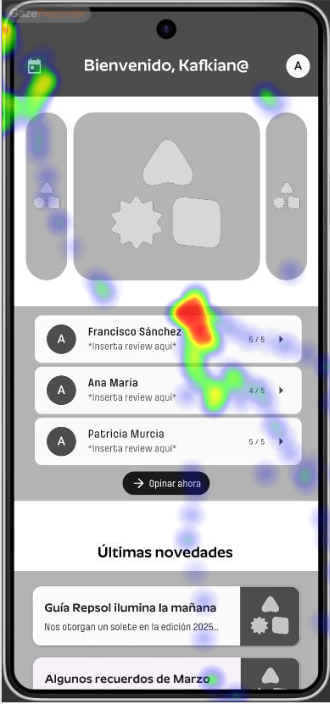;
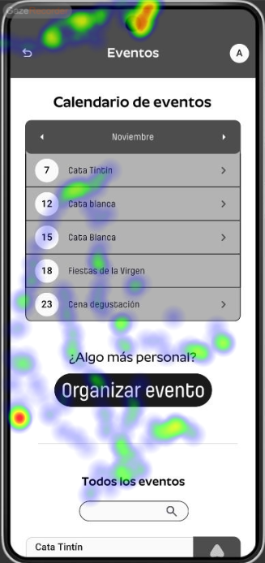;

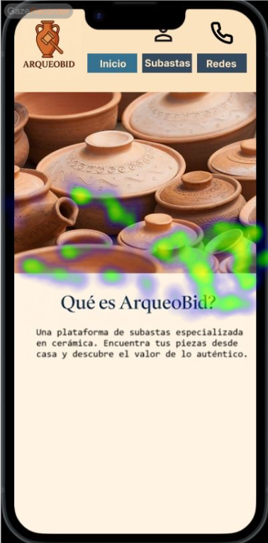;
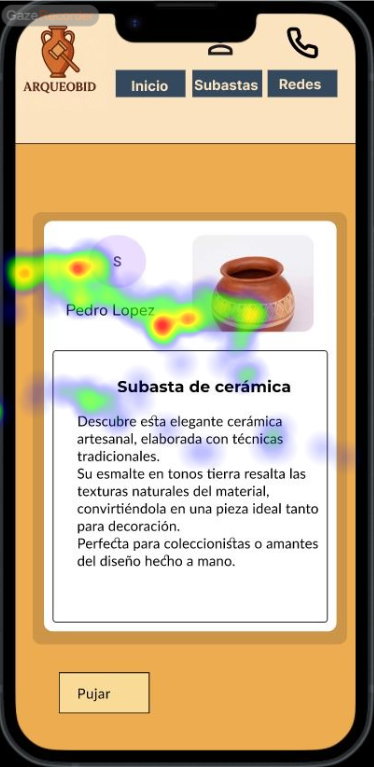;

### 4.c Cuestionario SUS
 
----

Como última parte de los tests realizados, se pidió a cada participante que rellenase el cuestionario SUS sobre el caso que habían visto y probado. Estos fueron los resultados.

| # Id.usuario | Caso | Puntuación SUS |
| ------------ | ---- | -------------- |
| 1            | A    | 82.5           |
| 2            | A    | 90             |
| 3            | A    | 77.5           |
| 4            | B    | 62.5           |
| 5            | B    | 70             |

Se pueden ver los tests SUS completos en la carpeta [resultados_sus](./resultados_sus/).

#### 4.c.1 Conclusiones de los cuestionarios SUS

Antes de exponer nuestras conclusiones sobre los resultados de estos cuestionarios, nos gustaría destacar que nuestro estudio ha estado muy limitado en el número de usuarios que hemos podido reclutar, y también en su variedad.

Finalmente, las puntuaciones medias quedan de la siguiente forma: el caso A con una media de 83.3, dentro del rango aceptable, y el caso B con una media de 66.25, dentro del rango marginal.

Consideramos que los resultados, aunque muy útiles para obtener feedback de usuarios reales, no son lo suficientemente numerosos como para formar una muestra representativa de la calidad de cualquiera de los casos. Ambos casos han tenido sus problemas, y ambos han tenido sus áreas destacadas.

>>> Como uno de los test para la prueba A/B testing, usaremos el **Cuestionario SUS** que permite valorar la satisfacción de cada usuario con el diseño utilizado (casos A o B). Para calcular la valoración numérica y la etiqueta linguistica resultante usamos la [hoja de cálculo](https://github.com/mgea/DIU19/blob/master/Cuestionario%20SUS%20DIU.xlsx). Previamente conozca en qué consiste la escala SUS y cómo se interpretan sus resultados
http://usabilitygeek.com/how-to-use-the-system-usability-scale-sus-to-evaluate-the-usability-of-your-website/)
Para más información, consultar aquí sobre la [metodología SUS](https://cui.unige.ch/isi/icle-wiki/_media/ipm:test-suschapt.pdf)
>>> Adjuntar en la carpeta P4/ el excel resultante y describa aquí la valoración personal de los resultados 

### 4.d Conclusiones del estudio realizado

A modo de resumen de todo lo aprendido de este estudio, ofrecemos la siguiente valoración:

Las técnicas aplicadas en la realización de este estudio nos han proporcionado una buena primera experiencia. La gran variedad de metodologías que se pueden aplicar dan lugar a que existan muchas posibilidades para conocer mejor los puntos fuertes y débiles de nuestros proyectos. 

Saber obtener feedback de los usuarios, que al fin y al cabo son quienes van a usar nuestras propuestas, es crucial en el mundo de la informática, y esta práctica nos lo ha hecho saber. Las dificultades afrontadas durante la realización del estudio son una parte más de la experiencia, y también se ha aprendido de ellas.

### 4.e Usability Report de B
 
-----

El reporte de usabilidad asociado al caso B se detalla en el siguiente documento: [Usability Report "ArqueoBid"](./P4/Usability_Report_B.md)

 

## Paso 5. Exportación y Documentación 

### 5.a Exportación a HTML/React
 
----

>>> Breve descripción de esta tarea. Las evidencias de este paso quedan subidas a P5/

### 5.b Documentación con Storybook

----

>>> Breve descripción de esta tarea. Las evidencias de este paso quedan subidas a P5/

 

## Conclusiones finales & Valoración de las prácticas

>>> Opinión FINAL del proceso de desarrollo de diseño siguiendo metodología UX y valoración (positiva /negativa) de los resultados obtenidos. ¿Qué se puede mejorar? Recuerda que este tipo de texto se debe eliminar del template que se os proporciona 

